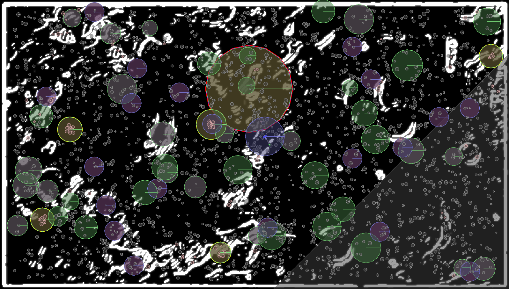
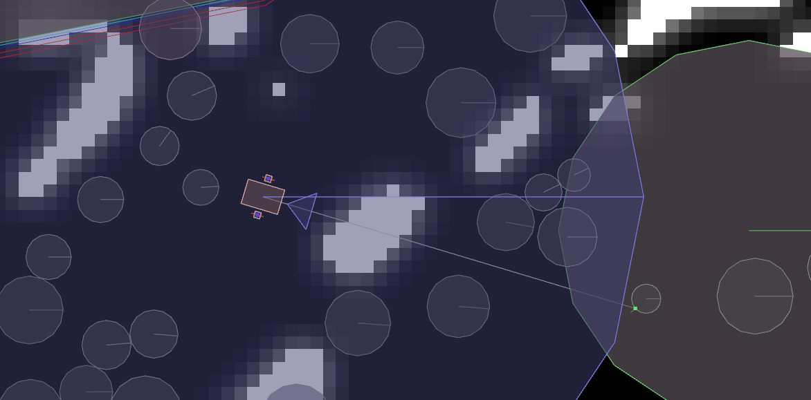

# Marsim
Simulator module for an integrated project work at Örebro University.

# Build Status

# Download
Make sure to be logged-in on GitHub, then download the simulator from this link: https://github.com/Mormert/marsim/actions
- Select a commit (that has a green OK mark).
- Scroll down to "artifacts".
- Download for Windows, Mac or Linux.

(Intended for fellow MscEng students at Örebro University, taking the 6 month course "Integrated Project Work in Computer Science")

# Visual Debugger

# Tools & Libraries Used
- __Box2D__ for physics simulation
- __stb_image__ & stb_image_write for image loading/writing
- __json.hpp__ for JSON processing
- __Mosquitto__ as MQTT client library
- __GLM__ for mathematics
- __Zlib__ for network message compression
- __zlibcomplete__ for C++ interface to Zlib
- __glad__ for OpenGL loading
- __GLFW__ for window management
- __Dear ImGui__ for user interface
- __CMake__ for cross-platform compilation
- __OpenGL 3.3__ for graphics rendering

C++ 17 is required. Builds for Mac, Windows & Linux.
